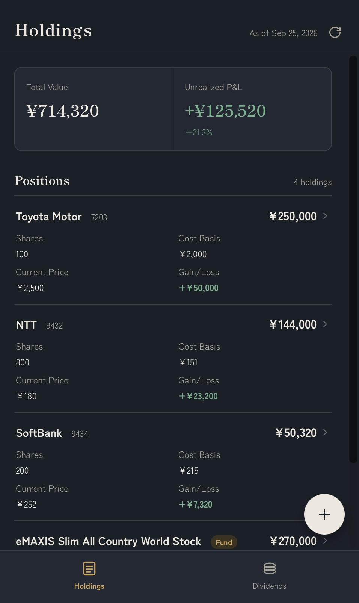
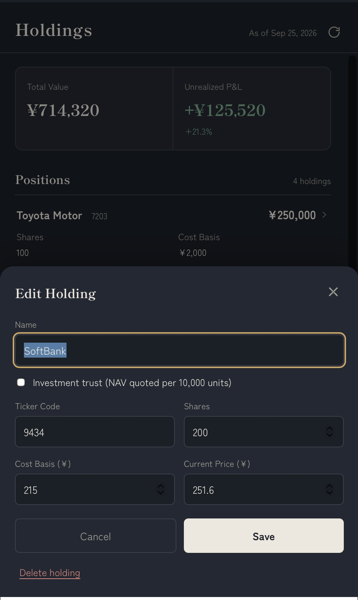
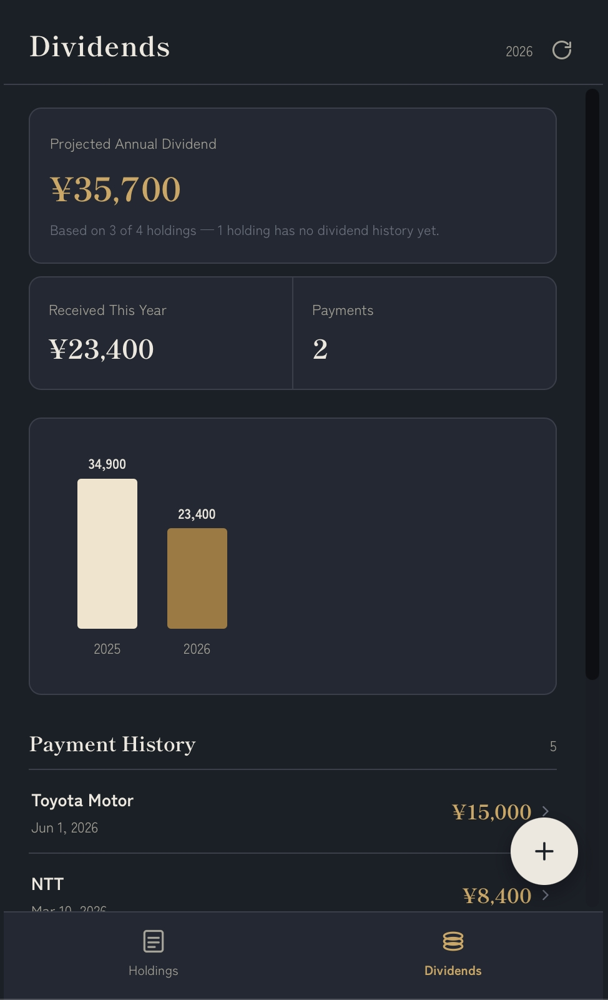

English | [日本語](README.ja.md)

# Dividend Notebook (配当ノート)

A personal dividend and holdings tracker for Japanese stocks and investment
trusts. Runs as a small local web app on your own machine — no cloud
account, no external database, just CSV files on disk.

Built for a specific personal workflow: check portfolio value and dividend
income from a phone over [Tailscale](https://tailscale.com), with data that
stays entirely on your own hardware.

## Features

- **Holdings tracking** — stocks and Japanese investment trusts (投資信託),
  with automatic valuation, unrealized gain/loss, and correct math for
  investment trusts (NAV quoted per 10,000 units, not per unit).
- **Dividend tracking** — record payments received, see a yearly bar chart,
  and a **projected annual dividend** estimate calculated from each
  holding's most recent recorded payment.
- **One-click sync** — pulls current prices and dividend history from Yahoo
  Finance (via [`yfinance`](https://github.com/ranaroussi/yfinance)) for any
  holding with a ticker code. No API key or account needed.
- **Mobile-first UI** — tab-based navigation (Holdings / Dividends),
  designed for use on a phone screen.
- **Fully local** — data lives in plain CSV files in `data/`, never leaves
  your machine unless you choose to sync it somewhere yourself.

## Screenshots

| Holdings | Edit Holding | Dividends |
|---|---|---|
|  |  |  |

## Architecture

| Layer | Choice | Why |
|---|---|---|
| Backend | Python + [FastAPI](https://fastapi.tiangolo.com/) | Simple REST API, no auth/session complexity needed for a single-user local app |
| Frontend | Vanilla JS / HTML / CSS | No build step, no npm — the whole frontend is one static file |
| Storage | CSV files (`data/holdings.csv`, `data/dividends.csv`) | Human-readable, easy to back up or inspect directly, no database to manage |
| Price/dividend data | [`yfinance`](https://pypi.org/project/yfinance/) | Free, no API key, decent coverage for Japanese exchange-traded securities |

```
DividendApp/
├── backend/
│   ├── main.py           # FastAPI app + routes
│   ├── models.py         # Pydantic request/response models
│   ├── storage.py        # CSV read/write layer
│   ├── price_sync.py     # yfinance-based price/dividend sync
│   └── requirements.txt
├── frontend/
│   └── index.html        # Entire frontend: HTML, CSS, JS in one file
├── data/
│   ├── holdings.csv       # Your portfolio (gitignored — personal data)
│   └── dividends.csv      # Your dividend history (gitignored)
├── ops/
│   └── com.dividendapp.server.plist   # macOS launchd config (auto-start)
└── files/                 # Original design notes / reference scripts
```

## Setup

Requires Python 3.9+.

```bash
git clone <this-repo-url>
cd DividendApp
python3 -m venv venv
source venv/bin/activate
pip install -r backend/requirements.txt
uvicorn backend.main:app --host 0.0.0.0 --port 8000
```

Then open `http://localhost:8000` in a browser. `data/holdings.csv` and
`data/dividends.csv` are created automatically on first run.

Use `--host 0.0.0.0` (not the default `127.0.0.1`) if you want to reach the
app from another device on your network or via Tailscale — `127.0.0.1`
only accepts connections from the same machine.

## Usage

### Holdings tab

- Tap **+** to add a holding: name, ticker code, shares, cost basis, current
  price.
- Check **"Investment trust (NAV quoted per 10,000 units)"** for Japanese
  mutual funds (投資信託) — this changes the labels to "Units"/"NAV" and
  divides the valuation math by 10,000 to match how funds are actually
  quoted (基準価額).
- Tap any row to edit or delete it.
- The summary card shows total portfolio value and unrealized P&L.

### Dividends tab

- Tap **+** to record a dividend payment (name, net amount received, date).
- The top stat is a **projected annual dividend**: the sum of each currently
  held holding's most recently recorded dividend payment — a rough forecast
  of this year's income based on last known payouts, not a guarantee.
- Below that: actual amount received so far this year, a yearly bar chart,
  and the full payment history.

### Sync button

The refresh icon in the header pulls fresh data for every holding that has
a ticker code set:

- **Price**: latest quote via `yfinance`.
- **Dividends**: historical per-share payments via `yfinance`, converted to
  an estimated *net* (after-tax) amount using Japan's standard listed-stock
  withholding rate (20.315%). This is an approximation — it will be wrong
  for tax-advantaged accounts (e.g. NISA) or non-standard tax situations.
- Holdings without a ticker code (e.g. investment trusts, which aren't
  exchange-traded) are silently skipped — there's no free, reliable API for
  Japanese investment trust NAV/distribution data, so those still need to be
  entered manually.

## Optional: remote access via Tailscale

Since this runs as a local server, [Tailscale](https://tailscale.com) lets
you reach it securely from a phone or another device without port
forwarding or a static IP:

1. Install Tailscale on the host machine and any device you want to access
   it from, and sign into the same account on both.
2. Start the server with `--host 0.0.0.0` (see Setup above).
3. Find the host's Tailscale IP with `tailscale status`, then visit
   `http://<tailscale-ip>:8000` from the other device.

## Optional: auto-start on login (macOS)

`ops/com.dividendapp.server.plist` is a `launchd` LaunchAgent config that
starts the server automatically when you log in and restarts it if it
crashes. Edit the paths inside it to match your own username/install
location, then:

```bash
cp ops/com.dividendapp.server.plist ~/Library/LaunchAgents/
launchctl bootstrap gui/$(id -u) ~/Library/LaunchAgents/com.dividendapp.server.plist
launchctl enable gui/$(id -u)/com.dividendapp.server
```

To stop it: `launchctl bootout gui/$(id -u)/com.dividendapp.server`

## Data model

**`data/holdings.csv`**

| Field | Type | Notes |
|---|---|---|
| `id` | string | UUID, auto-generated |
| `code` | string | Ticker code (e.g. `7203`), blank for non-exchange-traded holdings like investment trusts |
| `name` | string | Display name |
| `shares` | number | Shares (or units, for investment trusts) held |
| `costPrice` | number | Acquisition price per share/unit (per 10,000 units if `isFund`) |
| `currentPrice` | number | Current price per share/unit (per 10,000 units if `isFund`) |
| `isFund` | boolean | `true` if this is an investment trust (changes valuation math) |

**`data/dividends.csv`**

| Field | Type | Notes |
|---|---|---|
| `id` | string | UUID, auto-generated |
| `name` | string | Matched against holdings by name (not code) |
| `amount` | number | Net amount received (after tax) |
| `date` | string | ISO date (`YYYY-MM-DD`) |

## Known limitations

- **Single user, no auth** — this is designed to run on a private network
  (behind Tailscale or similar). There's no login system; anyone who can
  reach the server can use it.
- **Dividend tax estimate is approximate** — auto-synced dividends assume
  standard 20.315% withholding, which won't be accurate for NISA accounts
  or unusual tax situations.
- **Investment trusts are manual-entry only** — there's no free, reliable
  API covering Japanese mutual fund NAV and distributions the way
  `yfinance` covers exchange-traded stocks/ETFs.
- **`yfinance` is an unofficial API** — it scrapes Yahoo Finance rather than
  using a documented, stable API, so it can occasionally break if Yahoo
  changes something upstream.

## License

MIT — see [LICENSE](LICENSE).
